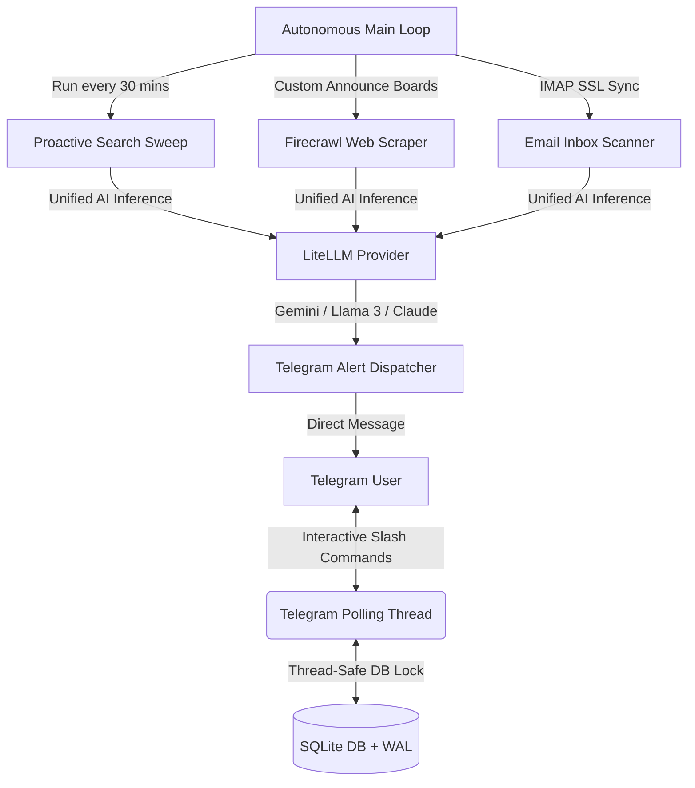

# 🚀 PiCareerAgent (picareeragent)

An autonomous, server-oriented, lightweight, and multi-user AI-driven career assistant. It is 100% compatible with Raspberry Pi, Linux servers, and cloud daemons. Operating silently in the background 24/7, PiCareerAgent monitors custom announcement boards, performs smart proactive web-crawls, scans incoming emails using Large Language Models (LLMs), triggers automated spam unsubscription loops, and delivers instant, visually rich notifications to your **Telegram** account with custom CV and career mentor advice.

---

## 🗺️ Table of Contents
1. [Key Features](#-key-features)
2. [Architecture Design](#%EF%B8%8F-architecture-design)
3. [Configuration Reference](#%EF%B8%8F-configuration-reference)
4. [Deployment & Installation](#-deployment--installation)
5. [Telegram Bot Interactive Commands](#-telegram-bot-interactive-commands)
6. [Prerequisites & Key Setup Guide](#-prerequisites--key-setup-guide)
7. [Production Best Practices & Thread Safety](#-production-best-practices--thread-safety)
8. [File Structure](#-file-structure)

---

## ✨ Key Features

* **🌍 Proactive AI-Driven Searches**: Daily generates 10 hyper-optimized local search queries customized to your target region (Global, TR, US, EU) and language using advanced AI.
* **📝 Dynamic Web Scraping Pipeline**: 
  * **Global Sweep**: Periodically executes pre-configured high-probability career rules (bootcamps, open-source programs, certifications, hackathons).
  * **Custom Sites Crawl**: Extracts full page markdowns using [Firecrawl](https://firecrawl.dev) and filters them using custom instructions defined by the user.
* **💼 Smart Job Application Tracker**: Fully automated database storage (`SQLite`) tracking your applications. Supports viewing stats, updating application stages, and deleting records via Telegram commands.
* **📬 LLM Email Analyzer**: Connects to your IMAP mailbox over a secure SSL channel, parses incoming messages using AI to capture critical recruitment updates, and automatically updates the job tracker status (applied ➡️ interview ➡️ accepted/rejected).
* **🚫 Programmatic One-Click Unsubscribe**: Automatically detects newsletter and marketing subscription lists using AI, and executes background unsubscribing operations.
* **🔒 Multi-User Secure DB**: Secure multi-user environment locked behind `AUTHORIZED_CHAT_IDS`. Powered by SQLite with Write-Ahead Logging (WAL) and Python `threading.Lock` thread-safety guarantees.

---

## 🏗️ Architecture Design

PiCareerAgent is written completely in modern Python and features a lightweight **service-oriented architecture**:



### 🧠 Unified AI Completions (LiteLLM)
Instead of locking you into a single proprietary LLM endpoint, PiCareerAgent utilizes `litellm`. This allows seamless integration with any major AI provider:
* **Google Gemini** (Generous free tier via Google AI Studio)
* **OpenRouter** (Llama 3, DeepSeek, Qwen)
* **OpenAI** (GPT-4o, GPT-4o-mini)
* **Anthropic** (Claude 3.5 Sonnet)

---

## ⚙️ Configuration Reference

Configuration is managed strictly via environmental variables defined in the `.env` file:

| Variable | Type | Required | Description |
| :--- | :--- | :--- | :--- |
| `LLM_PROVIDER` | String | Yes | Provider name: `gemini`, `openai`, `openrouter`, `anthropic`. |
| `LLM_MODEL` | String | Yes | Specific model name (e.g. `gemini/gemini-1.5-flash` or `meta-llama/llama-3.3-70b-instruct`). |
| `LLM_API_KEY` | String | Yes | API access key for your chosen provider. |
| `REGION` | String | Yes | Default proactive search region: `global`, `tr`, `us`, `eu`. |
| `LANGUAGE` | String | Yes | System messaging language: `en`, `tr`. |
| `FIRECRAWL_API_KEY` | String | Yes | Web scraping engine API key from `firecrawl.dev`. |
| `TELEGRAM_BOT_TOKEN` | String | Yes | Telegram API token obtained from `@BotFather`. |
| `TELEGRAM_CHAT_ID` | String | Yes | Primary Telegram chat ID for system alerts. |
| `AUTHORIZED_CHAT_IDS` | String | Yes | Comma-separated list of authorized chat IDs allowed to interact with the bot. |
| `EMAIL_ACTIVE` | Boolean | No | Set `True` to activate IMAP scanning daemon thread. |
| `EMAIL_AUTO_UNSUBSCRIBE` | Boolean | No | Set `True` to let AI unsubscribe from marketing lists. |
| `EMAIL_1_IMAP_SERVER` | String | No | Secure IMAP Server URL (e.g. `imap.gmail.com`). |
| `EMAIL_1_PORT` | Integer | No | IMAP Server Port (e.g. `993` for SSL). |
| `EMAIL_1_USER` | String | No | Your email address username. |
| `EMAIL_1_PASSWORD` | String | No | Email password or Gmail App-specific password. |
| `LOG_FILE_PATH` | String | No | Filepath to write logs to (default: `data/app.log`). |

---

## 🚀 Deployment & Installation

Deploying PiCareerAgent in a production environment takes less than 3 minutes.

### 1️⃣ Clone the Repository
```bash
git clone https://github.com/ibodeth/PiCareerAgent.git
cd PiCareerAgent
```

### 2️⃣ Initialize Environment File
Create a new `.env` file in the root directory and configure your keys:
```ini
LLM_PROVIDER=gemini
LLM_MODEL=gemini/gemini-1.5-flash
LLM_API_KEY=AIzaSy...

REGION=global
LANGUAGE=en

FIRECRAWL_API_KEY=fc-...
TELEGRAM_BOT_TOKEN=8567...
TELEGRAM_CHAT_ID=7500...
AUTHORIZED_CHAT_IDS=7500...

EMAIL_ACTIVE=True
EMAIL_AUTO_UNSUBSCRIBE=True
EMAIL_1_IMAP_SERVER=imap.gmail.com
EMAIL_1_PORT=993
EMAIL_1_USER=your_email@gmail.com
EMAIL_1_PASSWORD=your_gmail_app_password
```

### 3️⃣ Build and Launch Service
Run the background daemon via Docker Compose:
```bash
docker compose up -d --build
```

### 4️⃣ Verify Startup Logs
Ensure everything initialized perfectly:
```bash
docker compose logs -f picareeragent
```

---

## 📱 Telegram Bot Interactive Commands

Interact directly with your agent on Telegram using these interactive slash commands:

### ⚙️ System & Rules
* `/start` - Activate and register your profile on SQLite database.
* `/settings` - Start the step-by-step interactive wizard to customize language and targeted region.
* `/prompt <instructions>` - Set custom filtering rules for tracked sites (e.g. `/prompt look for remote internships`).
* `/prompt reset` - Return to standard career opportunity filtering rules.

### 🔗 Custom Site Tracking
* `/add <URL>` - Track a custom announcements page, career site, or community board.
* `/list` - List all websites currently tracked under your account.
* `/remove <ID>` - Stop tracking a specific website.

### 💼 Application Tracker
* `/apply <Company/Opportunity>` - Log a new job/bootcamp application.
* `/applications` - View all logged applications, stages, and stats.
* `/status <ID> <stage>` - Update application stage (e.g. `/status 1 interview`, `/status 1 accepted`).
* `/delete <ID>` - Delete an application log from database.

---

## 🔑 Prerequisites & Key Setup Guide

1. **Google Gemini**: Sign up at [Google AI Studio](https://aistudio.google.com/), click **Get API Key**. Extremely fast, reliable, and free of charge.
2. **Firecrawl**: Sign up at [Firecrawl.dev](https://www.firecrawl.dev/) for a free API token allowing lightning-fast markdown extraction.
3. **Telegram Bot Token**: Send `/newbot` to the official `@BotFather` account on Telegram, name your bot, and copy the HTTP API Token.
4. **Telegram Chat ID**: Message `@userinfobot` to get your numeric Chat ID. Remember to press **Start** on your new bot!
5. **Gmail App Password**: Go to your Google Account Security, enable **2-Step Verification**, search **App Passwords**, name it `PiCareerAgent`, and copy the 16-character code.

---

## 🔒 Production Best Practices & Thread Safety

When running PiCareerAgent 24/7 on servers or Raspberry Pi:
* **SQLite Persistence**: Ensure that `data/` directory is mounted correctly using Docker volumes. This guarantees database states survive container updates and re-builds.
* **Thread Safety**: The system applies strict `threading.Lock()` controls during SQLite operations to guarantee perfect database integrity under concurrent web sweeps and Telegram polling.
* **Rate Limits**: LiteLLM and Firecrawl are configured with strict timeouts and error handler loops to prevent indefinite hangs or API quota exhaustion.
* **OS Signals**: The container is equipped with clean signal handlers (`SIGINT`, `SIGTERM`) that release active threads, commit database transactions, and dispatch offline notifications via Telegram on shutdown.

---

## 📁 File Structure

```
PiCareerAgent/
├── app.py              # Pure-Python autonomous core engine
├── requirements.txt    # Production dependencies
├── Dockerfile          # Multi-architecture (ARM/AMD64) Docker file
├── docker-compose.yml  # Volume-mounted daemon run config
├── README.md           # This master documentation
└── data/               # Persistent database directory
    └── careeragent.db  # Multi-user thread-safe SQLite database
```

---

Got ideas, bugs, or feature requests? Feel free to open a Pull Request! Let's land that dream tech role! 🚀
